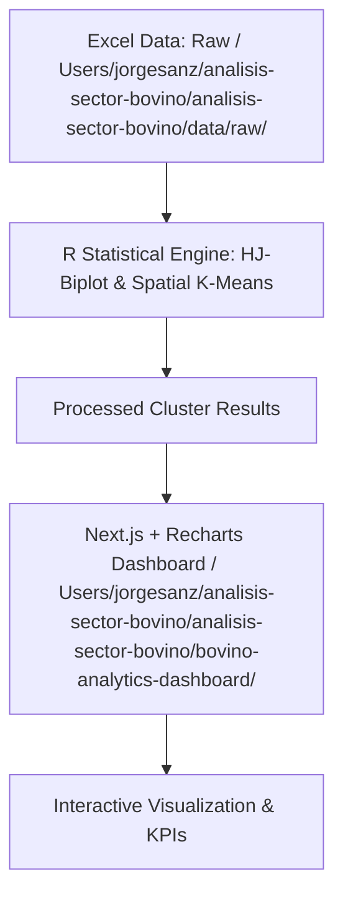

# Análisis Multivariante y Dashboard Interactivo del Sector Bovino en España


> 🚀 **Demo en Vivo**: [https://analisis-sector-bovino.vercel.app](https://analisis-sector-bovino.vercel.app)

---

## Contexto de Negocio

El sector bovino en España representa un pilar fundamental dentro de la industria agroalimentaria nacional, con un notable impacto económico en términos de producción, empleo rural y cohesión territorial. Sin embargo, este sector se enfrenta actualmente a retos significativos, como la volatilidad de los precios reales de mercado, la necesidad de optimizar las explotaciones y la creciente presión para implementar prácticas productivas respetuosas con el medio ambiente.

El objetivo de este proyecto es proveer un **diagnóstico integral y evaluar la viabilidad socioeconómica y ambiental** de las explotaciones ganaderas españolas a través del análisis de datos macro y micro-estructurales. Mediante la clasificación automática de las distintas comunidades autónomas, este sistema permite identificar patrones de sostenibilidad y rentabilidad para apoyar la toma de decisiones estratégicas.

---

## Arquitectura de Datos

El proyecto está diseñado bajo una arquitectura desacoplada en dos capas principales:



### 1. Motor Estadístico (R)
Ubicado en la carpeta [src/](file:///Users/jorgesanz/analisis-sector-bovino/analisis-sector-bovino/src/), es el encargado del análisis estadístico multivariante de las tres dimensiones principales (Estructural, Económica y Sostenibilidad):
- **HJ-Biplot**: Técnica de representación de filas y columnas en un espacio de baja dimensión para interpretar relaciones complejas entre variables y comunidades.
- **K-Means Espacial**: Algoritmo no supervisado para agrupar las comunidades autónomas españolas en clústeres homogéneos de sostenibilidad (Alto y Medio) a partir de los marcadores del biplot.

### 2. Capa de Visualización Interactiva (Next.js)
Ubicada en la carpeta [bovino-analytics-dashboard/](file:///Users/jorgesanz/analisis-sector-bovino/analisis-sector-bovino/bovino-analytics-dashboard/), es el dashboard web desarrollado con:
- **TypeScript & Tailwind CSS**: Para garantizar robustez en el tipado y un diseño web moderno de alto nivel con soporte responsivo.
- **Recharts**: Renderizado de gráficos vectoriales interactivos, incluyendo un gráfico de dispersión de clústeres y un gráfico de barras ordenado por producción.

---

## Instalación Local

Sigue los siguientes pasos para ejecutar el proyecto en tu entorno local:

### Requisitos Previos
- R (versión >= 4.0)
- Node.js (versión >= 18.x) y npm

### 1. Motor de Análisis Estadístico (R)
Entra en la carpeta de scripts de R y abre los ficheros para ejecutar o instalar sus dependencias:
```bash
# Navega al directorio src/
cd src/

# Abre la consola de R e instala las dependencias requeridas
R -e "install.packages(c('readxl', 'corrplot'))"

# Ejecuta el análisis descriptivo o de clústeres
Rscript 01_eda_correlaciones.R
Rscript 02_hj_biplot_sostenibilidad.R
```

### 2. Dashboard Web (Next.js)
Navega a la carpeta del dashboard, instala las dependencias de Node.js y arranca el servidor de desarrollo:
```bash
# Navega al directorio del dashboard
cd bovino-analytics-dashboard

# Instala dependencias npm
npm install

# Arranca el servidor de desarrollo local
npm run dev
```
La aplicación estará disponible de forma interactiva en [http://localhost:3000](http://localhost:3000).
